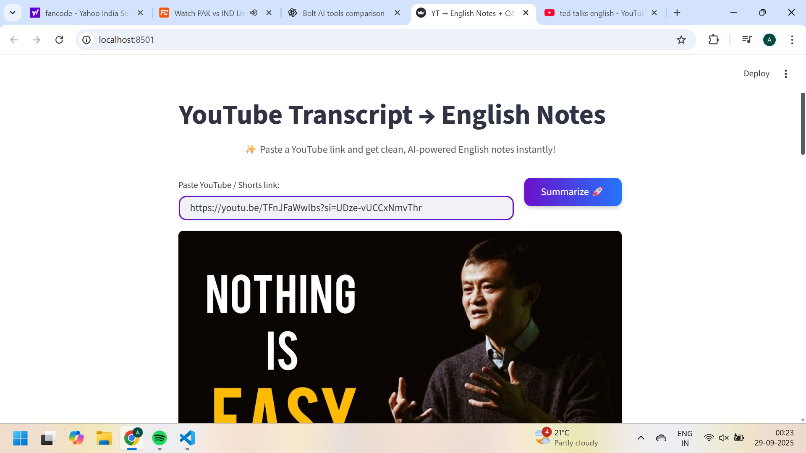
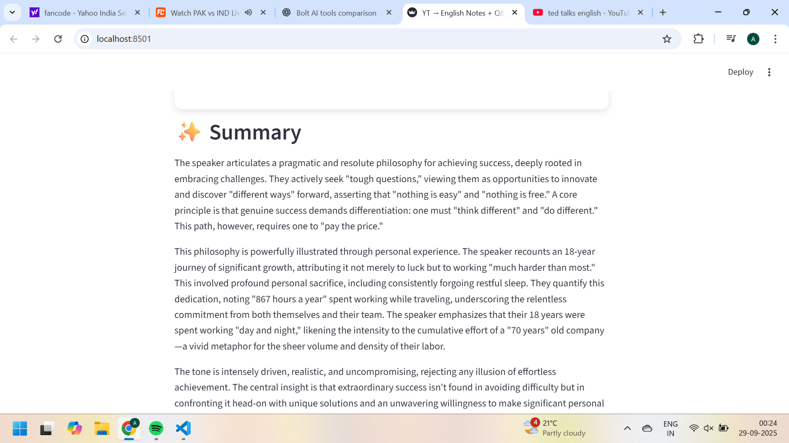
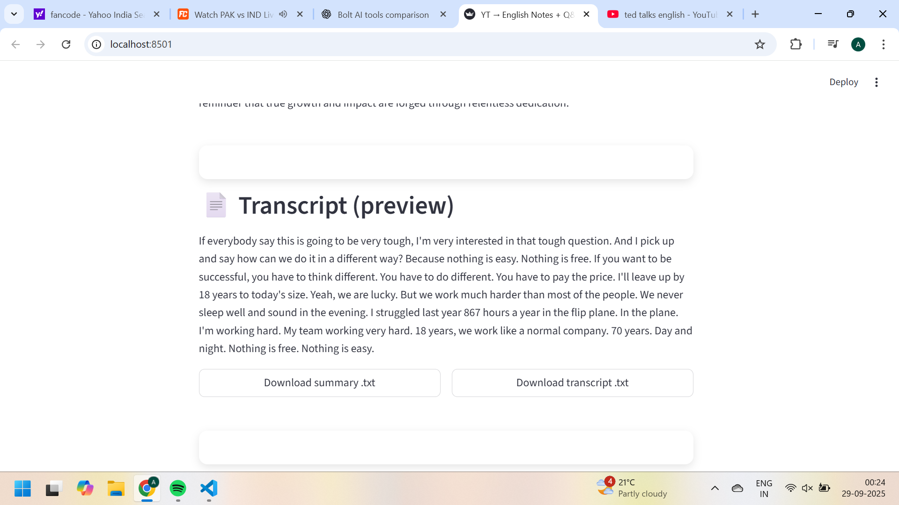
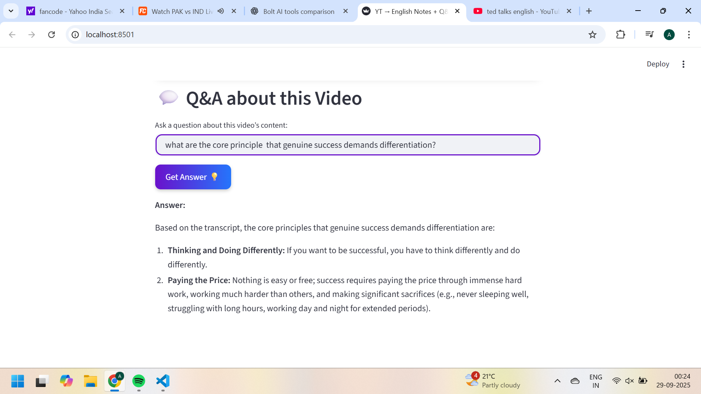

# 🎥 YouTube Transcript → English Notes + Q&A ✨

A **Streamlit Web App** that converts YouTube videos into **concise English summaries**, displays **transcripts**, and allows **AI-powered Q&A** about the video’s content.

---

## 🚀 Features

- 🎬 **Transcript Extraction**:  
  - Fetches transcripts directly from YouTube.  
  - If unavailable, uses **yt-dlp + FFmpeg + Whisper** to transcribe audio.

- 🌍 **Multi-Language Support**:  
  - Detects any spoken language in the video.  
  - Translates everything into **English**.

- 📝 **AI-Powered Summarization**:  
  - Generates clean, concise **200–250-word summaries** using **Gemini AI**.

- 💬 **Q&A Section**:  
  - Ask **any question** about the video content and get **instant AI answers**.

- ⬇️ **Download Options**:  
  - Download **Summary** and **Transcript** as `.txt` files.

- 🎨 **Beautiful UI**:  
  - Simple, responsive, and competition-ready interface built with **Streamlit**.

---

## 🖥️ Screenshots

### 🏠 Home Page


### 📸 Thumbnail Preview


### 📝 Summary Section


### 📄 Transcript Section


### 💬 Q&A Section


---

## 🛠️ Tech Stack

- **Frontend:** Streamlit, HTML, CSS (custom styling)  
- **Backend:** Python 3.10  
- **APIs & Tools:**  
  - YouTube Transcript API  
  - yt-dlp + FFmpeg (for audio)  
  - Whisper (speech-to-text)  
  - Gemini AI (summarization + Q&A)  

---
## 📂 Project Structure
├── app.py
├── requirements.txt
├── README.md
├── screenshots/
│ ├── Home.png
│ ├── thumbnail.png
│ ├── Summary.png
│ ├── Transcript.png
│ └── QASection.png
└── LICENSE


---

## ⚡ Installation & Setup

```bash
# Clone the repository
git clone https://github.com/archana19122004/youtube-transcript-notes.git

# Navigate into the folder
cd youtube-transcript-notes

# Install dependencies
pip install -r requirements.txt

# Run the app
streamlit run app.py

⚠️ Make sure FFmpeg is installed and added to your PATH.

🌈 Advantages
Saves time by avoiding full video watching.
Provides accurate English summaries of multilingual videos.
Offers interactive Q&A for better understanding.
Great for students, teachers, researchers, journalists.
Supports downloading notes for offline use.

⚠️ Limitations
Requires internet connection for AI and APIs
Whisper fallback may take longer for long videos.
Accuracy depends on audio quality and AI’s response.
Needs a valid Gemini API key.

🔮 Future Enhancements
📄 PDF download for summary & transcript.
🌗 Dark/Light mode toggle.
🎙️ Voice-based Q&A support.
☁️ Save directly to Google Drive/Cloud.
📏 Adjustable summary length.

📜 License
This project is licensed under the MIT License.

👩‍💻 Author
Archana V
BCA Student | AI & Web Development Enthusiast

🙏 Acknowledgements
Streamlit
YouTube Transcript API
yt-dlp
FFmpeg
Whisper by OpenAI
Gemini AI

⭐ If you like this project, give it a star on GitHub! ⭐

## 📂 Project Structure
